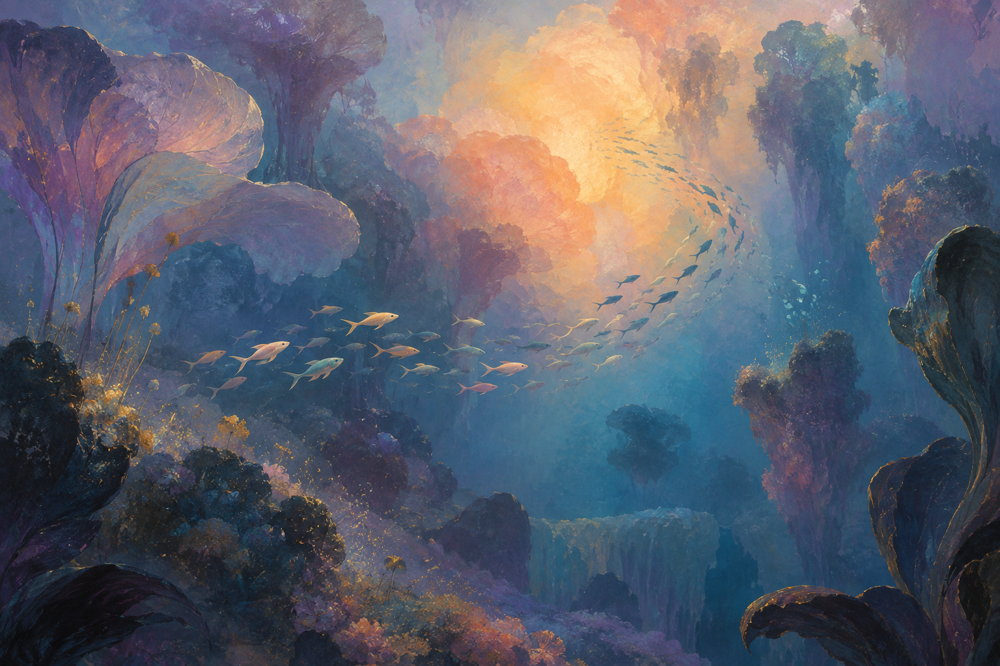
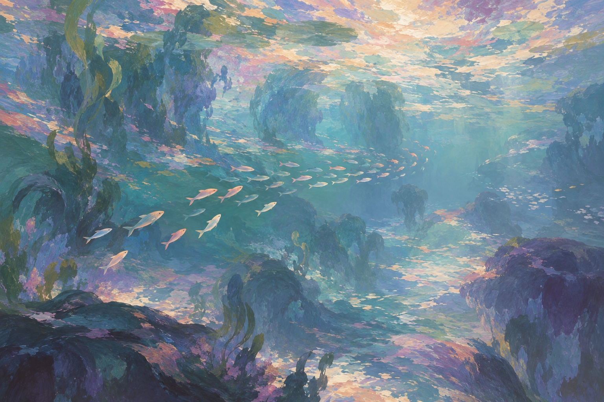

# 艺术史方向：梦幻海洋场景

第二轮概念探索，生成于 2026-09-23。在[第一轮 Shader 风格研究](../ShaderStudies/README.md)中，用户更倾向 B「海玻璃」与 C「绘画潮汐」，但希望进一步加强梦幻感。本轮从单条鱼的材质转向鱼群、海水、光与环境共同构成的完整画面。

**当前范围：制作 E「彩色梦境」的单场景风格样片，镜头完全固定，本版只验证美术风格；Boids、投喂与海域切换留到后续，F 保留为后续美术参考。** 本页图片由内置 image_gen 工具生成，属于美术方向参考，不是 Unity 实机截图。[首版 Unity 样片与实现说明](../../Redon/README.md)单独归档。概念图完整提示词见 [PROMPTS.md](PROMPTS.md)。

## E · 象征主义：彩色梦境

参考雷东晚期彩色作品的梦境气质，用紫蓝色水域、杏金色光区与巨大花瓣般的水生形体组织空间。小鱼群沿弧线穿行，鱼的尺度与周围形体形成距离感。

本图最有价值的是暖光与冷色阴影的关系，以及近处暗、远处亮的层次。鱼群成为画面的运动线索。当前生成结果仍保留了较明确的海底峡谷空间；后续若希望更抽象，可以进一步减弱地貌边界。

## F · 印象主义：流动光海（后续参考）

参考莫奈晚期《睡莲》的光色与笔触，转译为青绿、淡紫、粉橙和奶油白交错的水下场景。鱼身、植物与海水共用绘画语言，光以分散的色块贯穿画面。

本图最有价值的是水体内部的笔触节奏，适合讨论“游进一幅画”的感觉。当前全画面笔触较密，若制作动态版本，需要保留足够安静的区域，让鱼群和食物清楚可见。

## 比较与讨论

| 观察维度 | E · 彩色梦境 | F · 流动光海 |
| --- | --- | --- |
| 情绪 | 幽深、神秘，带有梦中景观的陌生感 | 轻盈、温柔，接近沉浸在绘画中的感受 |
| 光色 | 紫蓝背景与集中的杏金色亮区 | 青绿、淡紫与分散的粉橙亮色 |
| 鱼群的作用 | 以弧线引导视线，穿过层叠空间 | 与色块和笔触呼应，成为画面的一部分 |
| 后续需要验证 | 暗部与小鱼的辨识度 | 动态笔触的稳定性，以及视觉密度 |
| 与上一轮的联系 | 可延续 B 的柔和透光感 | 可延续 C 的绘画色块与彩色阴影 |

## 当前实现范围

用户已选择 E，先只做一个场景、完全固定镜头。在首版风格评审后，进一步要求尽量贴近概念图，并加入鱼群运动与投喂交互。

- **E 是当前唯一场景。** 保留幽深的紫蓝水域、局部杏金色亮区与层叠的花瓣状植物，目标是在 Unity 中形成一个可评审的实时渲染画面。
- **镜头完全固定。** 本版运行时不平移、不旋转、不缩放，也不添加自动运镜或鼠标视差；制作时可调整机位以匹配构图，交付时锁定。
- **以概念图为美术参照。** 重点检查整体构图、冷暖色关系、柔擦叠色、斑驳露底、绘画明暗、局部消隐的轮廓与远近层次。
- **加入鱼群与投喂。** 96 条鱼运行 Boids；鼠标投喂后附近鱼聚集、进食、散开并恢复巡游。镜头依然完全固定。
- **F 留作后续参考。** 当前不制作 F 场景、海域切换或对应的转场演出，保留概念图供未来讨论。

## 风格样片建议

鱼群以指向暖光的弧线作为初始构图，运行后自然游动；植物和固定机位继续围绕 E 的取景范围设计。

以固定机位的 Unity 截图与 E 对照，检查缩小画面后的色块和空间是否成立，以及近看时笔触能否参与明暗和边缘表现。另用真实运行录像检查鱼群转向、投喂与动态材质表现。

当前样片的实机截图、运行录像、Shader 方案与检查结果见 [Redon 实现记录](../../Redon/README.md)。概念画仍是目标参照，不能作为实时完成度的证明。

## 艺术参考

以下馆藏资料用于核对艺术参考；将其转译为海洋与 Shader 的方式是本项目的创作提案。没有把馆藏作品图片作为生成输入。

- 大都会艺术博物馆：[Odilon Redon — The Chariot of Apollo](https://www.metmuseum.org/art/collection/search/437380)
- 纽约现代艺术博物馆：[Claude Monet — Water Lilies](https://www.moma.org/collection/works/80220)

## 归档与检查

- 两张 PNG 均为 1536 × 1024。
- 每个方向独立生成一次；原始输出未经后期图像修改。
- 检查鱼群与环境的整体构图、色彩区别及图片完整性。
- 本页的静态概念画不能证明实时效果；Unity 渲染验证单独记录在 Redon 实现目录中，尚未完成性能基准测试。
