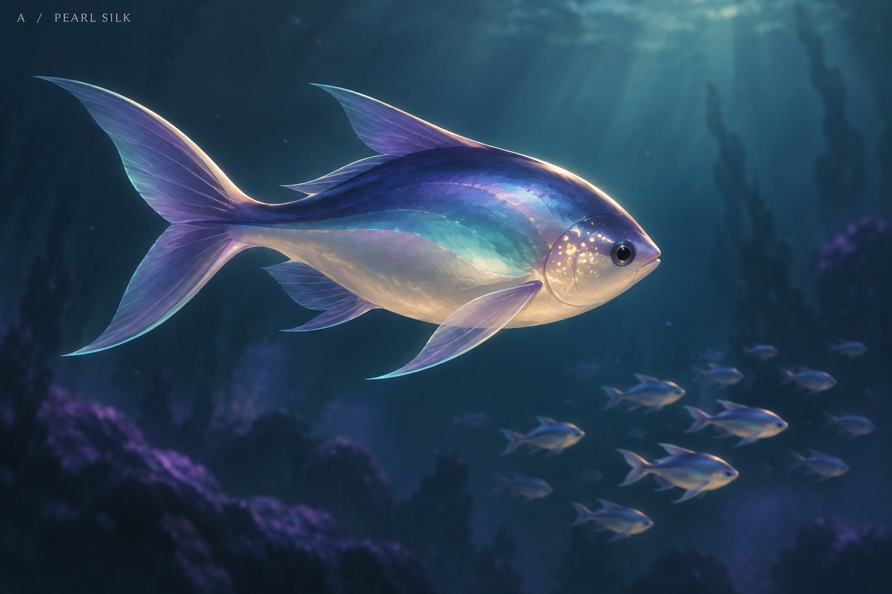
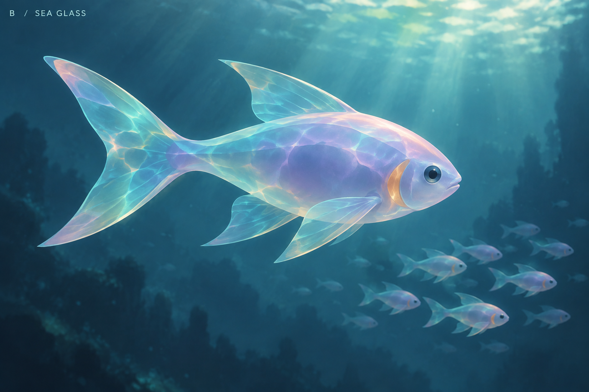
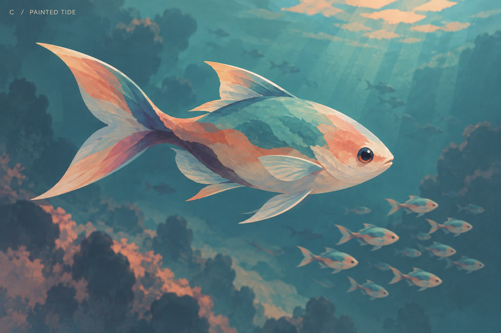
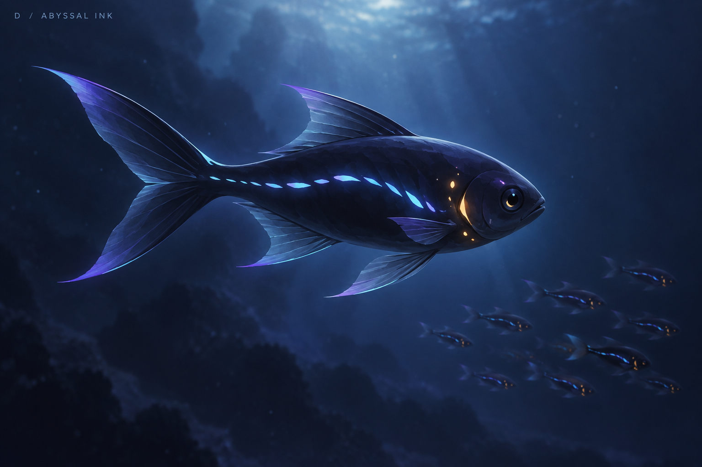

# 鱼类 Shader 风格概念研究

这组概念图用于讨论梦幻海洋 Boids 项目的渲染语言。重点是独立游戏的风格化美术：有设计的明暗与配色、表面质感、透明度、发光节奏，以及鱼群远近层次。

**本目录保留第一轮材质方向探索；当前已确定只制作 E 一个场景，暂不做海域切换，F 留作后续参考，见[第二轮场景方向](../ArtHistoryStudies/README.md)。** 图片由内置图像生成工具生成，属于美术目标，不代表已经实现的 Unity Shader 或实机效果；具体材质做法仍待讨论。

## 四个方向

| 方向 | 核心视觉语言 | 值得讨论的取舍 |
| --- | --- | --- |
| A · 珠光丝绸 | 青紫珠光、暖白腹部、柔和色带、薄纱鱼鳍 | 精致优雅，与现有月光鱼的配色较接近 |
| B · 海玻璃 | 半透明鱼身、乳白核心、彩色透光和焦散纹样 | 梦幻感突出；成群重叠时的辨识度需要实机检验 |
| C · 绘画潮汐 | 哑光色块、珊瑚橙与青绿、紫色阴影、颜料笔触 | 平面配色与立体形体结合，绘画感最明显 |
| D · 深海墨光 | 深色鱼身、稀疏发光侧线、少量琥珀色点缀 | 适合讨论群游时的光点节奏与深海氛围 |

### A · 珠光丝绸 / Pearl Silk

### B · 海玻璃 / Sea Glass

### C · 绘画潮汐 / Painted Tide

### D · 深海墨光 / Abyssal Ink

## 讨论方式

先比较整体气质、远处小鱼群的辨识度和主要色彩关系。确定方向后，再拆分成可实施的 Shader、贴图、灯光和形体调整。

四次生成共享相近的构图与鱼形描述，但并非像素级相同模型的材质替换，因此应视为方向比较。完整生成提示词见 [PROMPTS.md](PROMPTS.md)。

后续反馈更倾向 B 与 C，并希望加强梦幻感。参见[第二轮：艺术史与梦幻海洋](../ArtHistoryStudies/README.md)，将研究范围扩展到完整海洋场景。
