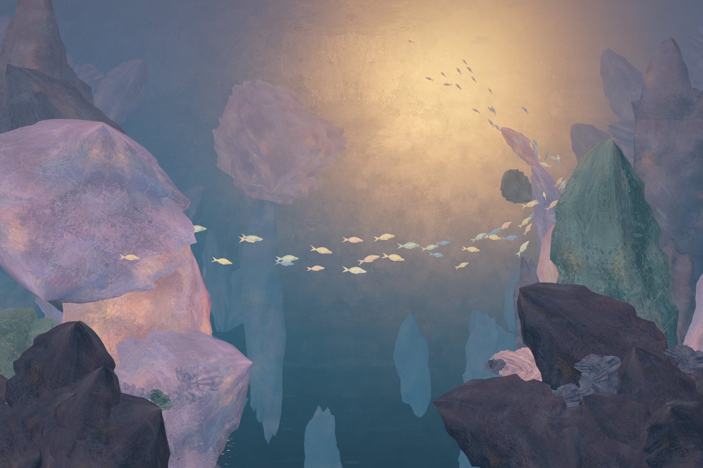

# E · 彩色梦境：Unity 风格样片

这是 E 概念方向的首版实时美术试验：一个三维海洋场景，完全固定的 3:2 镜头，以及 70 条静态摆放的月光鱼。目标是检验紫蓝水域、杏金色光区、巨大花瓣和绘画材质能否在 Unity 中成立。

上图由 Unity 场景相机直接渲染，1536 × 1024，没有后期图像修改。[概念图 E](../Concepts/ArtHistoryStudies/E-symbolist-dream-sea.png)只用于构图与色彩参考，没有作为背景板贴入场景。

## 打开与复现

1. 用 Unity 2022.3.62f2c1 打开仓库内的 `Boids_Proj`，URP 14.0.12。
2. 打开 `Assets/Boids/Scenes/RedonDream.unity`，切到 Game 视图。按 Play 也可查看；画面保持静止。
3. 不同窗口比例会留边以保留 3:2 构图。镜头位置、方向和正交尺寸不响应鼠标或键盘。
4. `Boids > Redon > Capture Style Study` 将相机画面保存到 `Captures/Redon_Style.png`；`Validate Style Scene` 输出场景检查报告。
   `Check Reload and Play Mode` 会重载已保存场景，在实际 Play 模式中间隔三秒捕获两帧并比较，完成后自动退出 Play。该检查由 Unity 编辑器独立执行，不依赖 MCP 全程保持连接。
5. `Build Fixed Camera Style Scene` 根据 C# 作者脚本和已提交纹理重新生成网格、材质与场景。重建会覆盖该样片的手工修改，调整前请提交 Git。普通查看无需重建，也无需 AI / MCP 服务。

## 绘画感如何实现

| 层次 | 实现 | 作用 |
| --- | --- | --- |
| 三维形体 | 参数化弯曲扇叶、叶片组合花冠、不规则岩体、枝脉网格 | 产生真实遮挡与空间层次 |
| 颜料明暗 | Painted Surface Shader，以颜料纹理扰动色阶、露底和少量法线 | 让明暗有色块与不均匀笔触 |
| 叠色 | AI 生成的紫蓝、粉紫和杏金色 underpainting | 给表面提供交错的颜色层次 |
| 干刷 | 独立白色笔触遮罩图集，贴在植物表面和部分轮廓的三维面片上 | 补充刷痕、破碎轮廓和金色细点 |
| 水体 | 按空间深度混色的雾与远处绘画色场 | 让远处形体逐步融入冷暖水色 |
| 整体处理 | 轻量 Bloom、调色和暗角 | 统一画面，保留笔触；没有全屏油画滤镜 |

三张纹理由内置 imagegen 生成，[完整提示词](PROMPTS.md)已归档。几何由 `RedonSceneBuilder.cs` 生成，鱼复用已有 Moonveil 模型并覆盖为新绘画材质。本场景禁用鱼的 Animator 和 MoonveilMotion。

`Art Direction - Redon` 对象集中控制颜料强度、法线扰动、雾、冷暖色与亮区位置。每种植物、岩体、鱼色的材质可独立调整。笔触固定在物体或世界空间，Shader 不使用时间驱动的纹理抖动。

场景相机使用独立的 Redon Renderer；原 URP 默认 Renderer 仍为索引 0。Painterly Shader 使用自定义的明暗方向参数，场景中的 Directional Light 不负责其阴影计算。

## 当前完成度

已实现实时场景、绘画材质、AI 纹理、静态鱼群构图和固定画幅。它是用于风格评审的第一版：大形体仍偏明确，距离概念图细密、柔软的花丛和丰富的笔触层次还有差距。

Boids、投喂、鱼的动态表现、F 场景和海域切换不在这版范围内。当前使用完整鱼模型和较密的花冠/枝条网格，没有完成 LOD、批处理或低配置性能优化；运行检查不等同于性能基准。

## 验证记录

- [场景检查](../../Boids_Proj/Captures/Redon_Validation.json)：缺失脚本、三张纹理、材质与 Shader、固定机位、70 条鱼、Volume 子资产持久化。
- [运行与重载检查](../../Boids_Proj/Captures/Redon_RuntimeValidation.json)：保存后重新打开、Play 模式前后画面与镜头检查。
- 重载前后、Play 模式前后与运行中两个时刻均比较相机输出，并保存 SHA-256 与逐像素差异。允许最多 0.01% 的像素出现不超过 2/255 的通道差异；镜头参数仍要求完全一致。该容差用于容纳观测到的少量 8 位渲染差异，不会把明显画面变化记为通过。

Shader 结构基于项目所用的 [URP 14 官方文档](https://docs.unity3d.com/Packages/com.unity.render-pipelines.universal@14.0/manual/writing-shaders-urp-basic-unlit-structure.html)。目前只验证 Windows / D3D11 / RTX 3090 的编辑器渲染，尚未做独立 Player 构建或跨平台验证。
