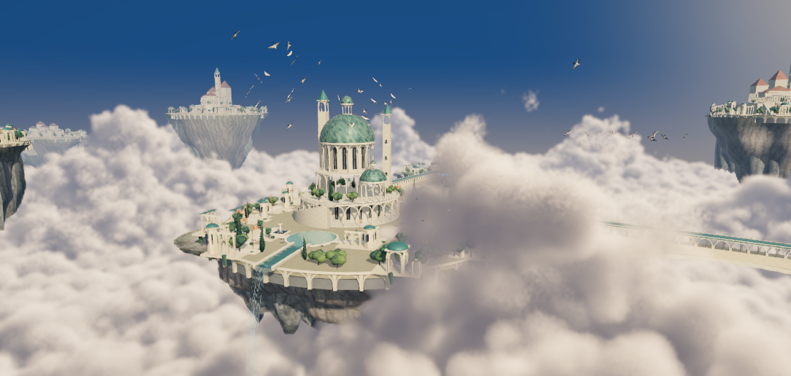
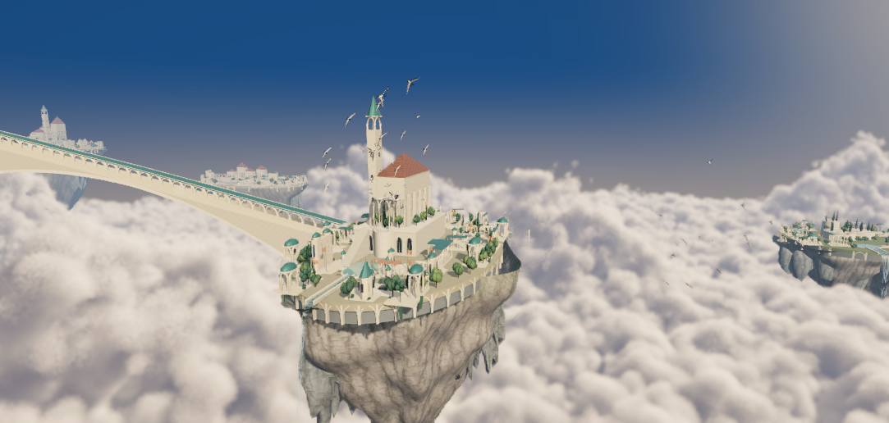
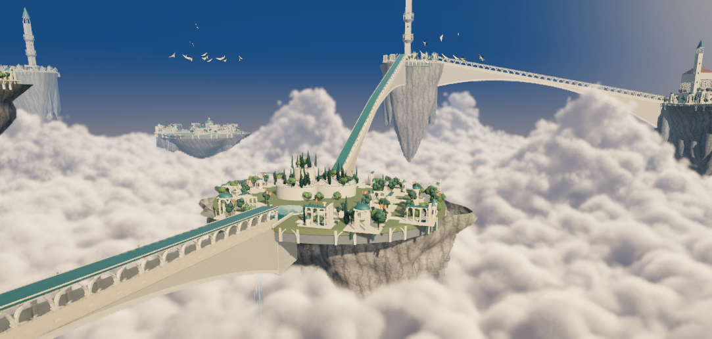
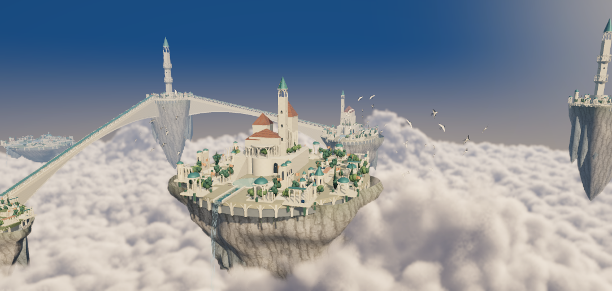
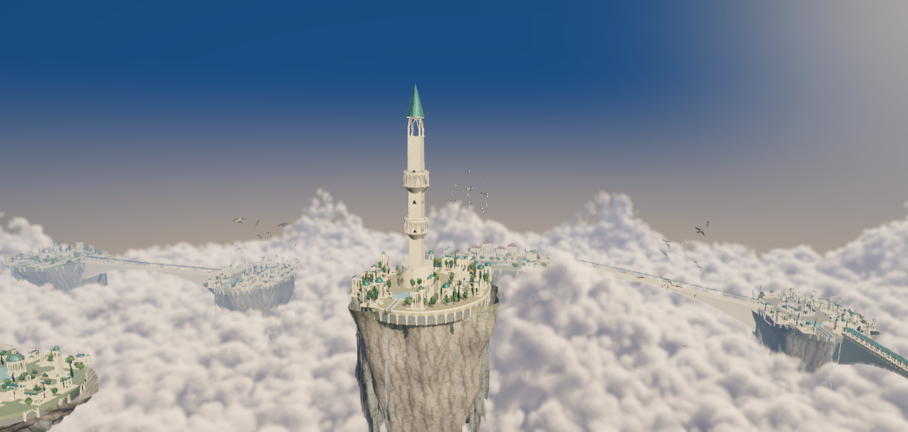
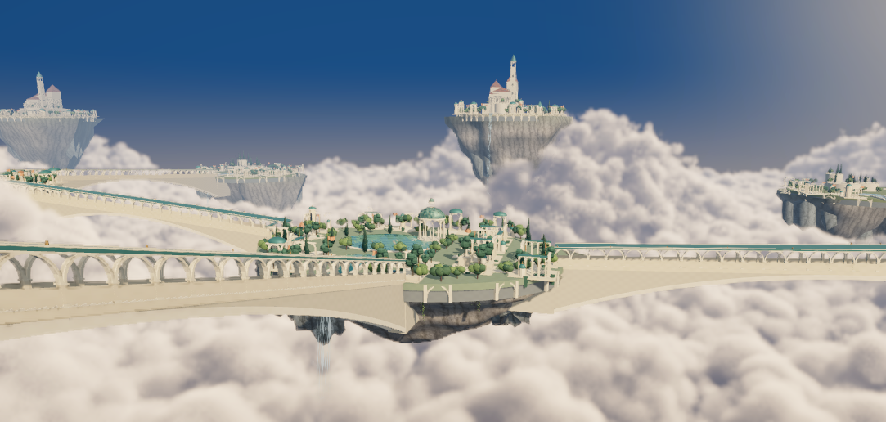
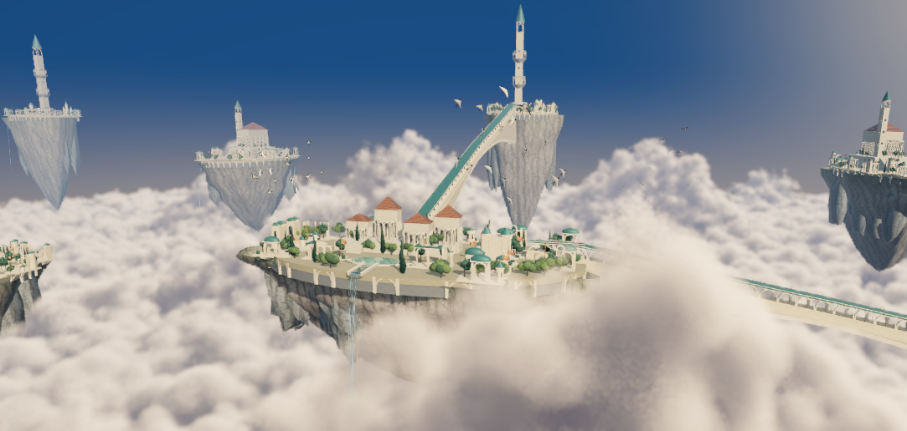
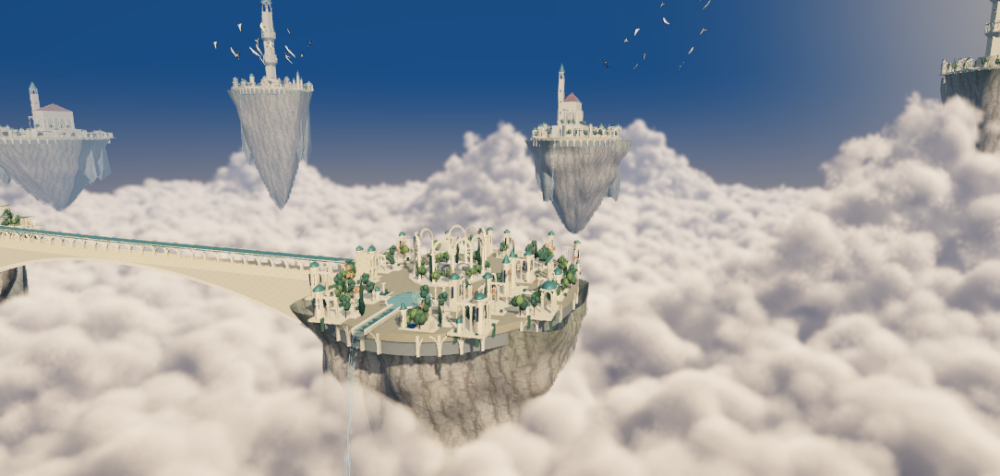

# 无尽风之庭园 · 八种城市轮廓

以下均为 Unity 实际运行截图。同一套模块根据区域权重、海拔、岛体比例和地标约束组合；云、鸟、水与旗帜仍在运动。

| 风之宫殿 | 狭长修道院 |
| --- | --- |
|  |  |

| 双岩体空中花园 | 阶台书库 |
| --- | --- |
|  |  |

| 孤峰天文塔 | 开放水庭 |
| --- | --- |
|  |  |

| 狭长村落 | 柱廊遗迹 |
| --- | --- |
|  |  |

[返回制作说明](README.md)
