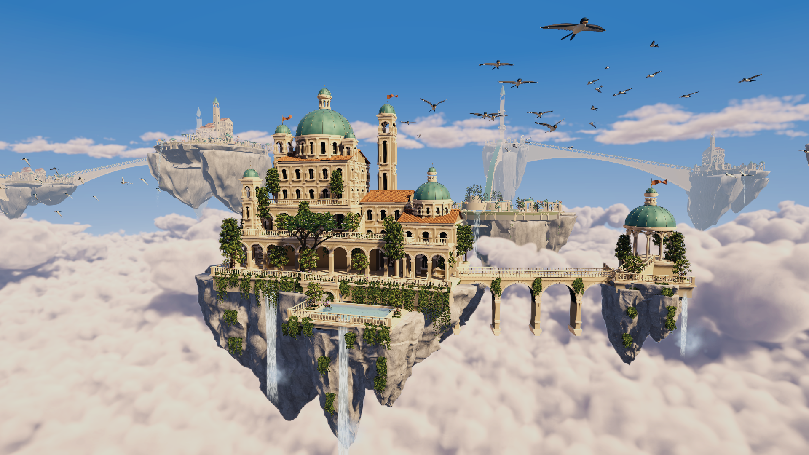

# 天空之城制作源

唯一运行场景为 `Sky_City_Project/Assets/SkyCity/Scenes/SkyCityWorld.unity`。操作、克隆与构建入口见 [项目 README](../../README.md)。

## 制作组成

- [主岛](../../Sky_City_Project/Tools/Island/README.md)：宫殿、拱廊、桥梁、伴岛和三级 FBX。
- [Districts](Districts/README.md)：128 个模块、8 种街区构图和压缩运行时模型库。
- [Rocks](Rocks/README.md)：雕塑式石灰岩体及复用网格。
- [Music](Music/README.md)：原创配乐、MIDI、采样许可与渲染脚本。
- [provenance.md](provenance.md)：概念图、纹理及早期云图的来源记录。

`build_sky_city.py` 保留共享燕子和基础建模函数的制作源，导出到 `Assets/SkyCity/Content/Shared`；当前主岛以 `Tools/Island/build_island.py` 为准。当前体积云由三维密度场渲染，概念图不作为场景背景或投影。

运行所需资源已随工程提交。Blender、Python 和 MCP 只用于修改制作源，直接运行场景不依赖这些工具。
