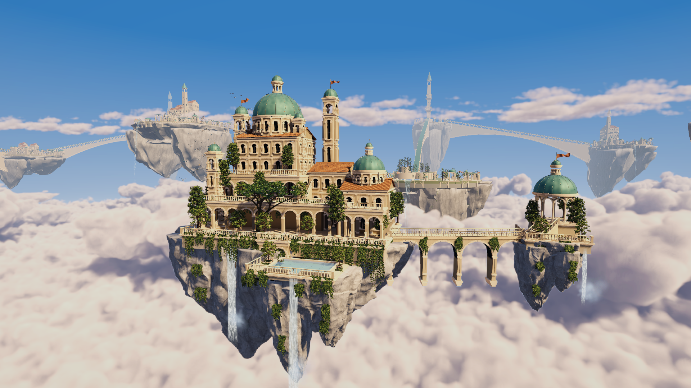
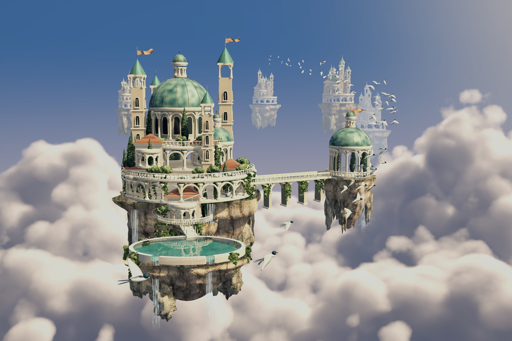
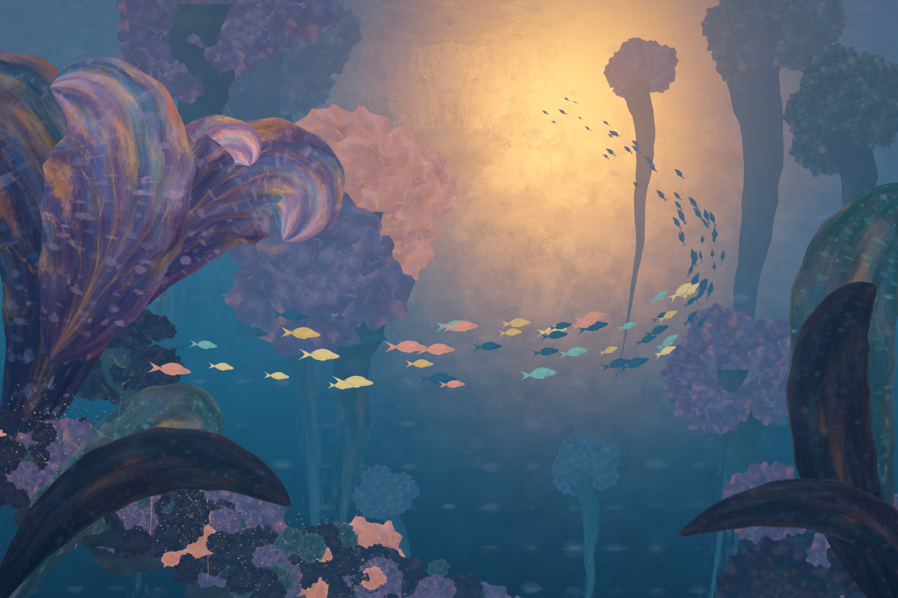
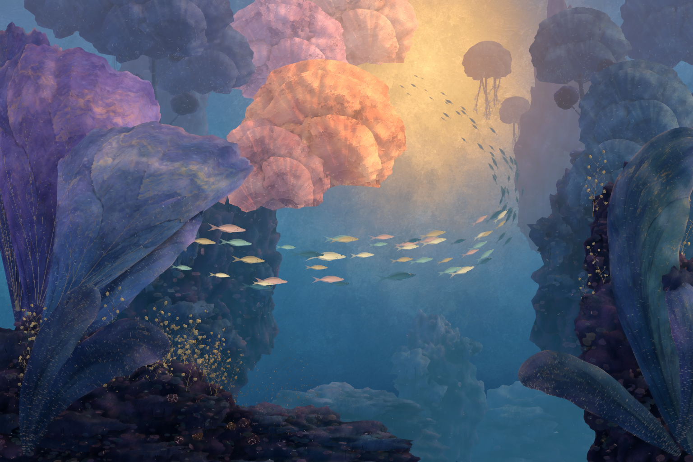

# Game Algorithms Implementation

## Current project: Sky City

Open **`Sky_City_Project`** in Unity Hub with **Unity 2022.3.62f2c1**, then open **`Assets/Boids/Scenes/SkyCityWorld.unity`**. Use branch `feat/redon-style-scene`.

The current scene combines the authored Hanging Gardens island with streamed WFC districts, flocking birds, recursive trees and cellular flower beds. Planting follows compatible architectural modules, their rotation, district shape and elevation. At most four beds and two recursive trees occupy each loaded district. Plants share cached meshes. Nearby gardens evolve, remote gardens pause, and unloaded gardens store their cell states in temporary session files for exact restoration on return. Exiting the world removes those session files.

| Control | Action |
| --- | --- |
| WASD and mouse | Fly and look around |
| Mouse wheel | Change flight speed |
| Q / E, Shift | Descend / rise, accelerate |
| Right click | Call the birds |
| G | Sow a seed in an aimed planting bed within 45 m |
| Esc | Flock, WFC and garden settings |
| F / M | Return to the main island / toggle music |

| Algorithm or technique | Application |
| --- | --- |
| Boids | Bird separation, alignment, cohesion and attraction |
| WFC | Select compatible architectural modules |
| Parametric recursive branching | Courtyard trees and staged growth |
| Four-state cellular automaton | Neighbour-driven budding, flowering and recovery |
| Multi-scale noise and ray marching | Moving volumetric clouds |
| Planar reflection and Fresnel blending | Reflective water |
| Streaming, LOD and floating origin | Bounded resident world and stable coordinates |



[Watch the 72-second scene tour](Sky_City_Project/Captures/SkyCityWorld/LivingCityJourney.mp4) — actual Unity Recorder footage with audio and a scripted camera route, including recursive growth, cellular flowers, live controls and a streamed district. This video is a demonstration, not a performance benchmark.

[Controls and implementation](Sky_City_Project/Tools/SkyCityWorld/README.md) · [Change log](CHANGELOG.md) · [Streamed garden verification](Sky_City_Project/Captures/SkyCityWorld/DistrictGardens_Runtime.json)

The Unity folder and product name are `Sky_City_Project`. Existing `Assets/Boids` paths and namespaces preserve asset references. GitHub remains `Game-Algorithms-Implementation`.

## Classroom materials

- [Download the presentation](Teaching/Game_Algorithms_Implementation.pptx?raw=true): 15 English slides, Chinese speaker notes and an embedded 72-second video of the corrected scene.
- [Chinese teaching notes](Teaching/Teaching_Notes_ZH.md)
- [Official tool and resource links](Teaching/Tools_Official_Links.md)
- [Standalone demo video](Sky_City_Project/Captures/SkyCityWorld/LivingCityJourney.mp4?raw=true)

The current presentation and footage correspond to source revision `1c34b5f`. Download the PPTX to play its embedded video. The video above is also available separately for classroom playback.

## Earlier scenes and production history

**用 AI Vibe Coding 实现可欣赏、可交互的游戏算法 Demo：Boids 群体行为、WFC 程序化生成与天空之城。**

**无限世界：天空之城 · 无尽风之庭园。** 打开 `Assets/Boids/Scenes/SkyCityInfinite.unity`，用 W / A / S / D 在云海上旅行，右键环顾、Q / E 升降、Shift 加速、Space 自动前行、F 返回。WFC 使用 **128 个实际建模模块**生成街区，组合为宫殿、修道院、花园、书库、孤塔、水庭、村落和遗迹八种城市轮廓。群岛错落在不同高度，长桥跨过云谷，邻近区域避免相同地标。按相机位置加载和卸载，最多驻留 25 个区块。


[128 个模块总览](Sky_City_Project/Captures/SkyCityInfinite_128Modules.png) · [制作与流式加载说明](ArtSource/SkyCity/Infinite/README.md) · [独立程序性能验证](Sky_City_Project/Captures/SkyCityInfinite_PlayerPerformance.json)。采用后台 WFC、分帧网格上传、远近 LOD、区块容器复用和浮动原点；体积云、反射水面、飘旗、鸟群与原创配乐持续运行。

[查看八种城市的实际画面](ArtSource/SkyCity/Infinite/Gallery.md)。地标高度、岛体比例、连接密度与植物配置共同形成变化；长期游览仍可能识别出有限的美术词汇。

最新增加 **「天空之城 · 风之庭园」**：晨光云海中的三维宫殿、空中花园、悬桥、瀑布和 64 只振翅飞行的燕子。打开 `Assets/Boids/Scenes/SkyCity.unity` 后按 Play，左键点击天空可引导鸟群，右键环视、滚轮缩放、中键平移、F 复位、M 开关音乐。云海漂移、旗帜飘动，80 秒原创钢琴／竖琴／弦乐配乐循环播放。



[观看有声交互预览](Sky_City_Project/Captures/SkyCity_LivingWorld.mp4) · [Blender 源文件、制作边界与重建方法](ArtSource/SkyCity/README.md)。建筑、植物、悬崖和鸟是三维模型；云海使用真正的三维体积密度、动态光照与流动细节；新建水庭园具备实时倒影、折射和朝溢流口移动的水流。鸟群自主转向、侧倾、振翅与滑翔。原有海底场景继续保留。

目标是让 Boids 群体行为成为可交互、可欣赏的游戏体验：在海洋中点击投放食物，鱼群靠近、进食，再自然散开。课程将从视觉效果出发，逐步解释分离、对齐、聚合及目标吸引的实现。

目前已完成 **Moonveil / 月光鱼** 的建模、骨骼与四段动画，以及 E「彩色梦境」的 Unity 交互样片：固定镜头、三维花瓣花园、绘画 Shader、96 条 Boids 鱼和鼠标投喂。鱼群会靠近金色食物，吃完后散开并恢复巡游。



[观看四段动画预览（MP4）](ArtSource/Moonveil/Preview/Moonveil_Motions.mp4) · [查看 Unity 实机画面](Sky_City_Project/Captures/Moonveil_Unity.png) · [美术资源说明](ArtSource/Moonveil/README.md)

**当前版本范围**：[E「彩色梦境」单场景、完全固定镜头、鱼群运动与投喂](ArtSource/Redon/README.md)。上图为实际 Unity 渲染；[观看实际运行视频](Sky_City_Project/Captures/Redon_Interaction.mp4)。[E / F 概念图](ArtSource/Concepts/ArtHistoryStudies/README.md)和[第一轮 Shader 概念图](ArtSource/Concepts/ShaderStudies/README.md)保留为参考。当前植物轮廓和笔触仍比概念画明确，风格还需持续评审。

## 快速开始

本地新增的美术重建场景是 `Assets/Boids/Scenes/RedonAtelier.unity`：巨型卷叶、层叠花冠、礁体与附生珊瑚均在 Blender 中建模，再以 FBX 接入 Unity。可编辑源文件、生成脚本和材质来源见 [Atelier 美术说明](ArtSource/Redon/Atelier/README.md)。



[查看新版投喂运行视频](Sky_City_Project/Captures/Atelier_Interaction.mp4)。新版保留固定相机、96 条带动画的鱼、Boids 与点击投喂；概念图仍作为美术参考，实机截图用于评价实际效果。

以下步骤查看当前 E 风格样片。

1. 克隆仓库：

   ```sh
   git clone --branch feat/redon-style-scene https://github.com/zyw1024/Game-Algorithms-Implementation.git
   ```

   当前交互样片位于上述开发分支，见 [PR #2](https://github.com/zyw1024/Game-Algorithms-Implementation/pull/2)。

2. 在 Unity Hub 中添加仓库内的 **`Sky_City_Project`** 文件夹。
3. 使用项目记录的 **Unity 2022.3.62f2c1** 打开，等待包恢复及资源导入。项目使用 **URP 14.0.12**；其他 Unity 版本尚未验证。
4. 打开 `Assets/Boids/Scenes/RedonDream.unity`，切换到 **Game** 视图并按 **Play**。鱼群自然游动；**鼠标左键点击中央水域投喂**，金色颗粒逐渐被吃完，鱼群随后散开。可同时放置三处食物，超过上限时替换最早的一处。
5. 相机完全固定；非 3:2 窗口会留边以保留构图，留边区域点击无效。当前食物投放在固定的水下深度平面。

如需单独检查鱼的四段动画，打开 `Assets/Boids/Scenes/MoonveilPreview.unity` 并按 Play。以下操作仅用于该动画预览：

| 操作 | 功能 |
| --- | --- |
| 按键 1 / 2 / 3 / 4，或底部按钮 | 悬停 / 巡游 / 加速 / 进食 |
| 鼠标左键拖动 | 旋转观察 |
| 鼠标滚轮 | 缩放 |

运行预览不需要启动 AI 客户端、Blender 或 MCP 服务。Unity MCP 编辑器包已固定在 `v10.2.0`，首次恢复该 Git 包需要网络及 Git。

## 目录

```text
Game-Algorithms-Implementation/
├── Sky_City_Project/              # Unity project: Assets, Packages, ProjectSettings
│   ├── Assets/Boids/        # Fish, animations, painterly shaders and scenes
│   └── Captures/           # Reviewed screenshot and validation results
├── ArtSource/Moonveil/     # Blender source, procedural authoring scripts and GLB
│   └── Preview/            # Stills and animation reel
├── ArtSource/Redon/        # Style implementation notes and AI texture prompts
├── ArtSource/SkyCity/      # Sky city Blender source, concept and asset provenance
├── ArtSource/Concepts/     # Archived visual directions
└── Setup/                  # Optional Blender / Unity MCP utilities
```

## 月光鱼资源

- 青蓝色鱼身、珠光腹部、金色眼睛、发光侧线与半透明鱼鳍。
- 13 根骨骼、两个蒙皮网格、两个材质槽，11,596 个三角形。
- **Hover**（3 秒）、**Swim**（1.6 秒）、**Dart**（0.8 秒）循环动画，以及 **Feed**（2 秒）单次动作。
- Unity 预制体以 **+Z 为前方**，关闭根运动，便于后续由 Boids 控制位置和朝向。
- Blender 源文件包含贴图、骨骼、动画和展示灯光；GLB 包含贴图与四段动画，供后续 HTML / Three.js 版本使用。

```csharp
// DreamSchoolController drives movement; MoonveilMotion drives skeletal animation.
fish.SetSwimSpeed(0.45f); // 0 = hover, 0.45 = cruise, 1 = dart
fish.Feed();             // One feeding motion, then resume swimming
```

制作环境为 Blender **5.2.2 LTS**。模型、贴图和动画由仓库内的 Python 脚本生成；无需外部美术素材。重建方式见 [美术说明](ArtSource/Moonveil/README.md) 和 [MCP 工具说明](Setup/README.md)。

## 验证与版本控制

已在 Blender 和 Unity 中检查蒙皮变形、三个循环的首尾衔接、预制体朝向，以及进食后恢复游泳的 Animator 状态切换。检查结果保存在 `ArtSource/Moonveil/Preview/blender-animation-validation.json` 与 `Sky_City_Project/Captures/`。

E 样片的场景完整性、Shader、资源持久化与运行检查另见 [Redon 说明](ArtSource/Redon/README.md)。版本按功能分支提交，通过 Pull Request 评审；美术样片与概念图分别保存。

Unity 使用可见 `.meta` 文件与文本序列化。仓库保留 `Assets`、`Packages`、`ProjectSettings` 和美术源文件；排除 `Library`、`Temp`、编辑器日志、用户设置、逐帧渲染缓存及本机 MCP 会话记录。当前资源体积较小，使用普通 Git 保存，不依赖 Git LFS。

## 后续计划

- [x] 三维鱼模型、材质与配套动作
- [x] Unity 动画预览与资源验证
- [x] E 单场景固定镜头美术初稿、绘画 Shader 与 AI 颜料纹理
- [x] 三维 Boids 鱼群与自然转向
- [x] 鼠标投喂、食物消耗与鱼群散开
- [ ] 根据实机评审细化环境造型、笔触和动态效果
- [ ] 鱼群数量测试与 LOD / 渲染优化
- [ ] HTML / Three.js 实现
