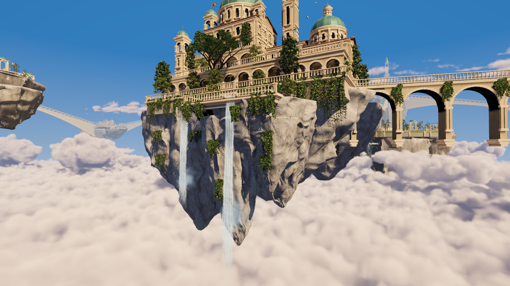

# Game Algorithms Implementation · Sky City

**天空之城：用 AI Vibe Coding 将游戏算法做成可以探索、交互和调参的三维场景。**

在云海中的悬空花园与城市之间自由飞行，呼唤燕群，观察递归树木生长，播种并改变花园的元胞演化规则。远处的街区由 WFC 选择兼容建筑模块，并随旅行加载、卸载。

默认分支 `main` 包含完整工程。项目只保留一个场景：**`Assets/SkyCity/Scenes/SkyCityWorld.unity`**。


[观看 / 下载实机演示](Sky_City_Project/Captures/SkyCityWorld/LivingCityJourney.mp4?raw=true) · [更新记录](CHANGELOG.md)

## 当前可以体验什么

- **第一人称天空探索**：在主岛、悬桥和远端街区间飞行，靠近观察建筑、岩壁、植物及水面；支持碰撞约束与一键返回主岛。
- **Boids 鸟群**：燕子自主巡游、转向、振翅和滑翔；右键召集后在前方盘旋，再自然散开。鸟群数量与行为权重可在菜单中调整。
- **WFC 城市生成**：128 个建筑模块、8 种街区构图，配合确定性种子、连接规则和生成权重。按相机位置管理驻留街区，加载范围可设为 9 / 25 / 49 个街区的上限。
- **递归树与元胞花园**：查看树木分层生长，向花坛播种，观察休眠、萌芽、盛开、恢复四种状态之间的传播。主岛与兼容的远端建筑模块均可承载花园。
- **完整场景美术**：拱廊宫殿、铜穹顶、悬桥、体积云、反射水面、瀑布、风动植物及原创配乐共同构成游览体验。
- **新版岩体**：9 种分别设计的岩体构型、错落断面与下垂尖峰，结合浅色石灰岩材质、贴岩藤蔓和瀑布凹槽；主岛和远端街区共用这套资产。



## 快速运行

已验证的开发环境为 **Windows、Unity 2022.3.62f2c1、URP 14.0.12**。通过 Unity Hub 安装对应编辑器；Git 用于克隆工程和恢复 Git 包依赖。

1. 克隆工程：

   ```sh
   git clone --depth 1 https://github.com/zyw1024/Game-Algorithms-Implementation.git
   ```

2. 在 Unity Hub 中添加仓库内的 **`Sky_City_Project`** 文件夹，等待资源导入与包恢复。
3. 打开 **`Assets/SkyCity/Scenes/SkyCityWorld.unity`**，按 **Play**。
4. 在编辑器中点击 **Game** 画面进入探索；按 **Esc** 打开场景设置。初次进入时等待附近街区加载。

仓库已包含运行所需的模型、材质、场景和预生成数据。**运行场景无需启动 Blender、AI 客户端或 MCP 服务**；这些工具用于制作和修改项目。Blender 源文件与生成脚本也保留在仓库中，方便进一步开发。

## 操作与设置

以下操作适用于当前入口 `SkyCityWorld.unity`。

| 操作 | 功能 |
| --- | --- |
| W / A / S / D + 鼠标 | 沿视线飞行、转向 |
| Q / E | 下降 / 上升 |
| Shift | 加速飞行 |
| 滚轮 | 调整移动速度 |
| 鼠标右键 | 呼唤鸟群 |
| G | 向瞄准的花坛播种，最远 45 米 |
| Esc | 打开 / 关闭场景设置并释放鼠标 |
| F | 返回主岛 |
| M | 静音 / 恢复配乐 |

场景设置包含三个页面：

| 页面 | 可调整内容 |
| --- | --- |
| 鸟群 | 数量（16–128）、飞行速度、转向、感知半径、间距、分离 / 对齐 / 聚合权重及召集行为 |
| 世界生成 · WFC | 种子、桥梁连接概率、岛缘完整度、花园与高塔权重、风格统一度、求解次数、加载范围及每帧生成预算 |
| 空中花园 | 递归层数、风动、树木生长播放、演化速度、萌芽阈值、盛开与恢复时间、风播种及规则着色 |

鸟群与花园参数即时生效。WFC 种子和生成权重需要点击「应用并更新街区」；加载范围与调度预算即时生效。打开菜单会暂停相机操作，场景中的鸟群、云、水与音乐继续运行。

远端花园随街区卸载时保存本次运行中的元胞状态，返回时恢复。**这些状态仅在同一次运行中保留**，退出世界后清除。完整行为与实现说明见[第一人称世界文档](Sky_City_Project/Tools/World/README.md)。

## 算法如何对应画面

| 算法 / 技术 | 在项目中的用途 | 主要实现 |
| --- | --- | --- |
| Boids | 分离、对齐、聚合，叠加目标吸引和预测避障 | [SkyCityFlock.cs](Sky_City_Project/Assets/SkyCity/Runtime/Flocking/SkyCityFlock.cs) |
| Wave Function Collapse | 按权重选择兼容建筑模块，传播邻接和连接约束 | [SkyCityWfc.cs](Sky_City_Project/Assets/SkyCity/Runtime/WorldGeneration/SkyCityWfc.cs) |
| 参数化递归分枝 | 庭院树木的多层分枝和缓存几何 | [SkyCityBotanyGeometry.cs](Sky_City_Project/Assets/SkyCity/Editor/Assets/SkyCityBotanyGeometry.cs) |
| 四状态元胞自动机 | 基于八邻域、同步更新的萌芽、盛开与恢复 | [SkyCityGardenAutomaton.cs](Sky_City_Project/Assets/SkyCity/Runtime/Gardens/SkyCityGardenAutomaton.cs) |
| 多尺度噪声与光线步进 | 动态体积云和云内明暗 | [Shader 目录](Sky_City_Project/Assets/SkyCity/Shaders) |
| 平面反射与 Fresnel 混合 | 水面的建筑倒影与视角相关反射 | [SkyCityWaterReflection.cs](Sky_City_Project/Assets/SkyCity/Runtime/Rendering/SkyCityWaterReflection.cs) |
| 流式加载、LOD、浮动原点 | 控制常驻对象数量并支持远距离探索 | [SkyCityInfiniteWorld.cs](Sky_City_Project/Assets/SkyCity/Runtime/WorldGeneration/SkyCityInfiniteWorld.cs) |
| 花园状态存取 | 街区加载时创建植物、卸载时保存状态、返回时恢复 | [SkyCityDistrictGardens.cs](Sky_City_Project/Assets/SkyCity/Runtime/Gardens/SkyCityDistrictGardens.cs) |

WFC 负责模块选择与约束传播，宏观构图和资产造型另外设计。树木使用有限层级的参数化递归分枝；风播种是元胞系统的可关闭外部输入。

## 美术资产与制作

主岛建筑、悬崖和模块资产通过 Blender 脚本建模、导出后接入 Unity；新增递归树与元胞花园使用 C# 工具生成缓存网格。运行时由 Unity 处理渲染、鸟群、花园状态与街区加载。概念图用于确定美术方向，本页效果图均来自 Unity。

- [主岛模型与场景制作](Sky_City_Project/Tools/Island/README.md)：Hanging Gardens 可编辑 Blender 文件与生成脚本。
- [岩体资产说明](ArtSource/SkyCity/Rocks/README.md)：9 种构型、源网格、贴岩植物和石灰岩材质。
- [街区与建筑模块](ArtSource/SkyCity/Districts/README.md)：128 个模块和 8 种街区构图的建模来源。
- [原创配乐与采样来源](ArtSource/SkyCity/Music/README.md)：Garden of Winds、MIDI、渲染脚本与资源说明。
- [AI 图像制作记录](ArtSource/SkyCity/provenance.md)与 [MCP 制作工具](Setup/README.md)。

## 工程目录

```text
Game-Algorithms-Implementation/
├── Sky_City_Project/             # 在 Unity Hub 中打开
│   ├── Assets/
│   │   ├── SkyCity/
│   │   │   ├── Scenes/           # 唯一场景与烘焙光照数据
│   │   │   ├── Runtime/          # Player、UI、Flocking、WorldGeneration、Gardens、Rendering、Diagnostics
│   │   │   ├── Editor/           # Assets、Build、Validation、Recording
│   │   │   ├── Content/          # Shared、Island、Districts、World
│   │   │   ├── Resources/        # 运行时按键加载的压缩模块库
│   │   │   └── Shaders/
│   │   └── Settings/            # URP 质量设置
│   ├── Packages/
│   ├── ProjectSettings/
│   ├── Tools/                   # Island 建模、World 字体和几何检查
│   └── Captures/                # 实机展示与验证记录
├── ArtSource/SkyCity/            # 概念参考、Districts、Rocks、Music 制作源
└── Setup/                       # 可选 MCP 工具
```

运行时代码命名空间为 `SkyCity.Runtime`，世界生成使用 `SkyCity.Runtime.WorldGeneration`；自定义 Shader 统一使用 `SkyCity/` 前缀。移动 Unity 资源时应保留对应 `.meta`，保持场景和预制体的 GUID 引用。

## 构建与维护

- 菜单 **Sky City → Open world** 打开唯一场景；**Sky City → Build → Windows player** 输出 `Sky_City_Project/Builds/SkyCityWorld/SkyCityWorld.exe`。
- **Sky City → Assets** 提供主岛重新导入、模块预制体烘焙、云和花园资源工具；修改模型后更新资产，不再从其他场景复制生成世界。
- **Sky City → Validation** 提供 WFC 与几何验证；运行时检查和录制说明见 [World 文档](Sky_City_Project/Tools/World/README.md)。
- 资源迁移验证及独立程序检查记录位于 [项目整理验证](Sky_City_Project/Captures/SkyCityWorld/ProjectCleanup/README.md)。

默认构建列表只包含 `SkyCityWorld.unity`。`Library`、`Temp`、本地构建、PPT 和讲义不纳入仓库当前版本。课件保留在本地，仓库专注可运行工程、制作源与项目文档。
