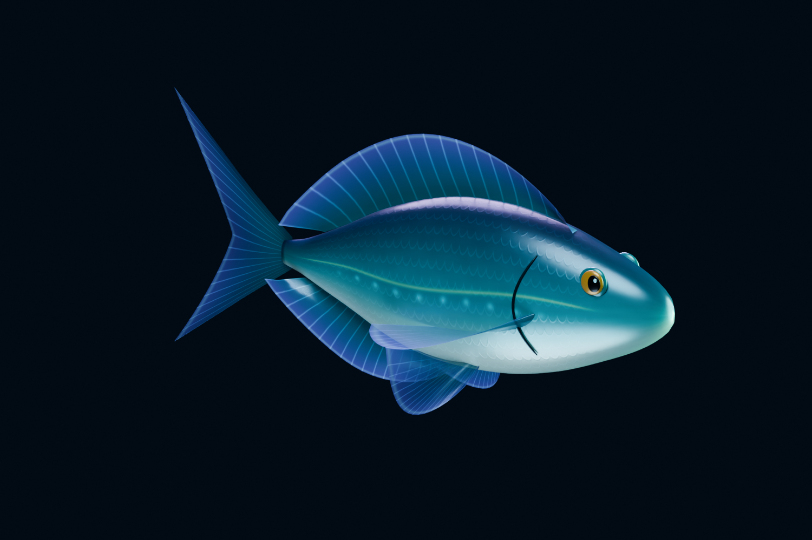

# Boids

**用 AI Vibe Coding 制作一个梦幻海洋鱼群项目。**

目标是让 Boids 群体行为成为可交互、可欣赏的游戏体验：在海洋中点击投放食物，鱼群靠近、进食，再自然散开。课程将从视觉效果出发，逐步解释分离、对齐、聚合及目标吸引的实现。

目前已完成第一条原创三维鱼 **Moonveil / 月光鱼** 的建模、材质、骨骼与四段动画，以及可以直接运行的 Unity 美术预览场景。**鱼群算法、投喂交互和完整海洋场景尚在后续开发计划中。**



[观看四段动画预览（MP4）](ArtSource/Moonveil/Preview/Moonveil_Motions.mp4) · [查看 Unity 实机画面](Boids_Proj/Captures/Moonveil_Unity.png) · [美术资源说明](ArtSource/Moonveil/README.md)

**美术方向探索（讨论中）**：[第一轮：四组 Shader 风格概念图](ArtSource/Concepts/ShaderStudies/README.md) 比较珠光丝绸、海玻璃、绘画色块与深海荧光；[第二轮：艺术史与梦幻海洋](ArtSource/Concepts/ArtHistoryStudies/README.md) 探索象征主义的彩色梦境与印象主义的流动光海。这些图片用于选择视觉方向，尚未转化为实机 Shader。

## 快速开始

1. 克隆仓库：

   ```sh
   git clone https://github.com/zyw1024/Boids.git
   ```

2. 在 Unity Hub 中添加仓库内的 **`Boids_Proj`** 文件夹。
3. 使用项目记录的 **Unity 2022.3.62f2c1** 打开，等待包恢复及资源导入。项目使用 **URP 14.0.12**；其他 Unity 版本尚未验证。
4. 打开 `Assets/Boids/Scenes/MoonveilPreview.unity`，按 **Play**。

| 操作 | 功能 |
| --- | --- |
| 按键 1 / 2 / 3 / 4，或底部按钮 | 悬停 / 巡游 / 加速 / 进食 |
| 鼠标左键拖动 | 旋转观察 |
| 鼠标滚轮 | 缩放 |

运行预览不需要启动 AI 客户端、Blender 或 MCP 服务。Unity MCP 编辑器包已固定在 `v10.2.0`，首次恢复该 Git 包需要网络及 Git。

## 目录

```text
Boids/
├── Boids_Proj/              # Unity project: Assets, Packages, ProjectSettings
│   ├── Assets/Boids/        # Fish prefab, URP materials, animations and preview
│   └── Captures/           # Reviewed screenshot and validation results
├── ArtSource/Moonveil/     # Blender source, procedural authoring scripts and GLB
│   └── Preview/            # Stills and animation reel
└── Setup/                  # Optional Blender / Unity MCP utilities
```

## 月光鱼资源

- 青蓝色鱼身、珠光腹部、金色眼睛、发光侧线与半透明鱼鳍。
- 13 根骨骼、两个蒙皮网格、两个材质槽，11,596 个三角形。
- **Hover**（3 秒）、**Swim**（1.6 秒）、**Dart**（0.8 秒）循环动画，以及 **Feed**（2 秒）单次动作。
- Unity 预制体以 **+Z 为前方**，关闭根运动，便于后续由 Boids 控制位置和朝向。
- Blender 源文件包含贴图、骨骼、动画和展示灯光；GLB 包含贴图与四段动画，供后续 HTML / Three.js 版本使用。

```csharp
// Animation interface; movement will be supplied by the Boids agent.
fish.SetSwimSpeed(0.45f); // 0 = hover, 0.45 = cruise, 1 = dart
fish.Feed();             // One feeding motion, then resume swimming
```

制作环境为 Blender **5.2.2 LTS**。模型、贴图和动画由仓库内的 Python 脚本生成；无需外部美术素材。重建方式见 [美术说明](ArtSource/Moonveil/README.md) 和 [MCP 工具说明](Setup/README.md)。

## 验证与版本控制

已在 Blender 和 Unity 中检查蒙皮变形、三个循环的首尾衔接、预制体朝向，以及进食后恢复游泳的 Animator 状态切换。检查结果保存在 `ArtSource/Moonveil/Preview/blender-animation-validation.json` 与 `Boids_Proj/Captures/`。

Unity 使用可见 `.meta` 文件与文本序列化。仓库保留 `Assets`、`Packages`、`ProjectSettings` 和美术源文件；排除 `Library`、`Temp`、编辑器日志、用户设置、逐帧渲染缓存及本机 MCP 会话记录。当前资源体积较小，使用普通 Git 保存，不依赖 Git LFS。

## 后续计划

- [x] 三维鱼模型、材质与配套动作
- [x] Unity 动画预览与资源验证
- [ ] 三维 Boids 鱼群与自然转向
- [ ] 鼠标投喂、食物消耗与鱼群散开
- [ ] 海洋环境、光束、粒子与镜头表现
- [ ] 鱼群数量测试与 LOD / 渲染优化
- [ ] HTML / Three.js 实现
